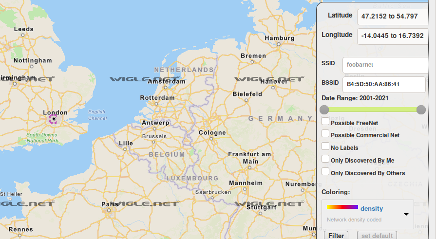
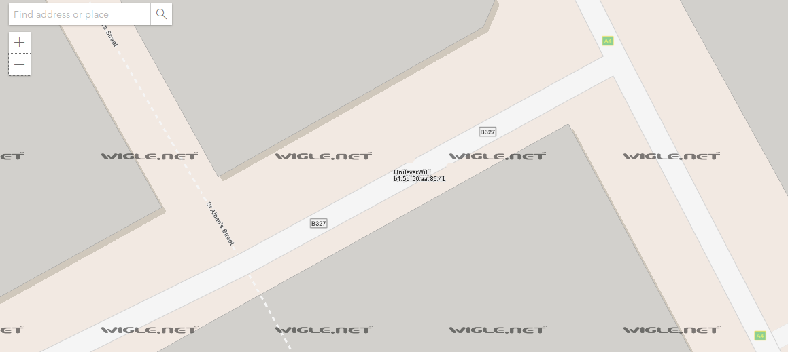
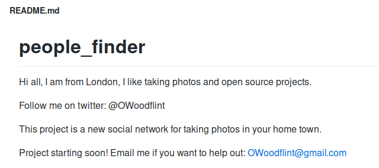

## What is this users avatar of?

get meta data from file

```console
kali@kali:~/Downloads$ exiftool WindowsXP.jpg 
ExifTool Version Number         : 12.01
File Name                       : WindowsXP.jpg
Directory                       : .
File Size                       : 229 kB
File Modification Date/Time     : 2020:07:22 01:48:04-04:00
File Access Date/Time           : 2020:07:22 01:48:46-04:00
File Inode Change Date/Time     : 2020:07:22 01:48:09-04:00
File Permissions                : rw-r--r--
File Type                       : JPEG
File Type Extension             : jpg
MIME Type                       : image/jpeg
XMP Toolkit                     : Image::ExifTool 11.27
GPS Latitude                    : 54 deg 17' 41.27" N
GPS Longitude                   : 2 deg 15' 1.33" W
Copyright                       : OWoodflint
Image Width                     : 1920
Image Height                    : 1080
Encoding Process                : Baseline DCT, Huffman coding
Bits Per Sample                 : 8
Color Components                : 3
Y Cb Cr Sub Sampling            : YCbCr4:2:0 (2 2)
Image Size                      : 1920x1080
Megapixels                      : 2.1
GPS Latitude Ref                : North
GPS Longitude Ref               : West
GPS Position                    : 54 deg 17' 41.27" N, 2 deg 15' 1.33" W
```
We can see copyright is by OWoodflint

Google this username and the first result is this twitter page

  (andyfeili.github.io/images/owoodflinttwitter.jpeg)

ans: cat

## What city is this person in?

The bssid is in one of the tweets

Bssid: B4:5D:50:AA:86:41

go to https://wigle.net/

type in the bssid, zoom all the way out then look around for a purple circle



ans: london

## Whats the SSID of the WAP he connected to?

zoom all the way in to see the ssid



ans: unileverwifi

## What is his personal email address?

the twitter description mentions this person likes open source projects, so we google OWoodflint github.

The first link goes to this Github page which shows the email address



ans: OWoodflint@gmail.com

## What site did you find his email address on?

ans: github

## Where has he gone on holiday?

twitter also mentions photography

we google owoodflint photography and the third link takes us to this webpage

https://oliverwoodflint.wordpress.com/author/owoodflint/

```
Im in New York right now, so I will update this site right away with new photos!
```
ans: New York

## What is this persons password?

view the source code of the webpage, we find this line of white text
```
<p style="color:#ffffff;" class="has-text-color">pennYDr0pper.!</p>
```
ans: pennYDr0pper.!
